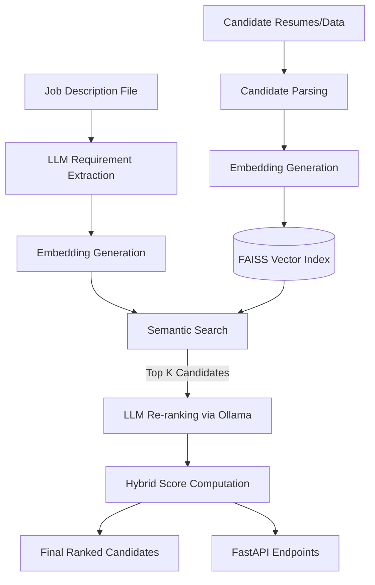

<div align="center">

# 🤖 AI Smart Candidate Ranking System

**A production-quality AI-powered candidate ranking system that uses semantic understanding rather than keyword matching to rank candidates against job descriptions.**

[](https://www.python.org/downloads/)
[](https://fastapi.tiangolo.com)
[](https://opensource.org/licenses/MIT)

</div>

---

## 📸 Screenshots

*Replace these placeholders with actual screenshots of your application.*

| CLI Pipeline | API Documentation | Output Table |
|:---:|:---:|:---:|
|  |  |  |

---

## 🏗️ Architecture Diagram



---

## ⚙️ How it Works

The AI Smart Candidate Ranking System moves beyond traditional ATS (Applicant Tracking System) keyword matching by using state-of-the-art NLP models to truly understand the *context* and *semantic meaning* of a candidate's profile relative to a job description.

### The Pipeline

1. **Ingestion & Parsing**: The system ingests job descriptions (TXT, PDF, JSON) and extracts structured requirements using an LLM. It concurrently loads candidate resumes (CSV, PDF, DOCX).
2. **Embedding Generation**: All text is converted into dense vector embeddings using `SentenceTransformers` (`BAAI/bge-large-en-v1.5`).
3. **Semantic Search**: We build a `FAISS` index of all candidates and perform a high-speed cosine similarity search to retrieve the top 30 most semantically relevant candidates.
4. **LLM Re-ranking (Ollama)**: The top candidates are evaluated individually by a local LLM across 8 dimensions (technical fit, experience, communication, leadership, etc.).
5. **Hybrid Scoring**: A final weighted score is computed (40% Semantic, 30% LLM, 15% Experience, 10% Skills, 5% Education).

---

## 📦 Tech Stack

| Component | Technology | Description |
|-----------|------------|-------------|
| **Core Framework** | Python 3.10+ | Primary language |
| **API Framework** | FastAPI + Uvicorn | High-performance async REST API |
| **Embeddings** | Sentence Transformers | Local dense vector representations (`BAAI/bge-large`) |
| **Vector Search** | FAISS | Facebook AI Similarity Search for sub-millisecond retrieval |
| **LLM Engine** | Ollama (`llama3`) | Local, private LLM inference for deep reasoning |
| **Data Processing** | Pandas, NumPy | Data manipulation and hybrid score computation |
| **UI/CLI** | Rich, Loguru | Beautiful progress bars and colored terminal logging |

---

## 📂 Folder Structure

```text
candidate-ranking/
├── app/
│   ├── api/               # FastAPI endpoints & routes
│   ├── core/              # Config, settings, and Loguru setup
│   ├── embeddings/        # SentenceTransformer service and FAISS index
│   ├── models/            # Pydantic schemas (Job, Candidate, RankingResult)
│   ├── parsing/           # Extractors for PDFs, DOCX, CSV, TXT
│   ├── prompts/           # LLM Prompt Templates for evaluation
│   ├── ranking/           # Hybrid Scorer, LLM Ranker, Semantic Ranker
│   ├── services/          # High-level Orchestration (Pipeline)
│   ├── utils/             # JSON parsing and text cleanup utilities
│   └── main.py            # FastAPI entry point
├── data/
│   ├── candidates/        # Input directory for candidate files
│   ├── job_descriptions/  # Input directory for job descriptions
│   └── output/            # Generated ranking CSVs
├── requirements.txt       # Project dependencies
├── run.py                 # CLI Entry point
└── README.md              # Project documentation
```

---

## 🚀 Installation

### Prerequisites
- Python 3.10 or higher
- [Ollama](https://ollama.ai/) installed locally (optional, but highly recommended for LLM re-ranking)

### Quick Setup

```bash
# 1. Clone the repository
git clone https://github.com/yourusername/candidate-ranking.git
cd candidate-ranking

# 2. Create and activate a virtual environment
python -m venv venv
source venv/bin/activate    # On Windows use: venv\Scripts\activate

# 3. Install dependencies
pip install -r requirements.txt

# 4. (Optional) Setup Ollama and pull the default model
ollama pull llama3
```

---

## ▶️ Usage

### Run the CLI Pipeline

The system includes sample data. You can run a full evaluation immediately:

```bash
# Run the pipeline and start the API server
python run.py

# Run the pipeline without starting the API server
python run.py --no-server

# Use custom data files
python run.py --jd data/my_job.txt --candidates data/my_candidates.csv
```

---

## 🌐 API Documentation

Once the server is running, interactive API docs are available at: **[http://localhost:8000/docs](http://localhost:8000/docs)**

### Key Endpoints

#### 1. `GET /health`
Check system health, loaded candidates, and FAISS index status.

#### 2. `POST /rank`
Rank candidates against a job description.

**Using form data (text):**
```bash
curl -X POST http://localhost:8000/rank \
  -F "job_description=Senior Machine Learning Engineer with 5+ years experience in Python, PyTorch, and AWS"
```

**Using a file upload:**
```bash
curl -X POST http://localhost:8000/rank \
  -F "file=@data/job_descriptions/sample_jd.txt"
```

**Sample JSON Response:**
```json
{
  "job_role": "Senior Machine Learning Engineer",
  "total_candidates": 20,
  "ranked_candidates": [
    {
      "rank": 1,
      "candidate_name": "Priya Sharma",
      "final_score": 92.4,
      "reason": "• Top Strength: Extensive ML pipeline experience.\n• Main Gap: Lacks direct cloud certification."
    }
  ]
}
```

---

## 🔮 Future Improvements

While this system is highly functional for a hackathon MVP, there are several areas for future expansion:

- [ ] **Multi-Agent Architecture**: Implement a multi-agent system where one agent reviews technical skills, another reviews cultural fit, and a "manager" agent synthesizes the final review.
- [ ] **Cloud Vector Database**: Migrate from local FAISS to a managed cloud vector database (e.g., Pinecone, Qdrant, or Weaviate) for horizontal scalability.
- [ ] **Web Frontend**: Build a React/Next.js dashboard for HR professionals to upload resumes and view ranked candidates in an interactive UI.
- [ ] **Bias Mitigation**: Implement automated bias checking in the LLM prompts to ensure equitable ranking regardless of gender, race, or background.
- [ ] **RAG for Candidate Q&A**: Allow recruiters to "chat" with a candidate's resume (e.g., *"Does Priya have experience with multi-modal architectures?"*).
